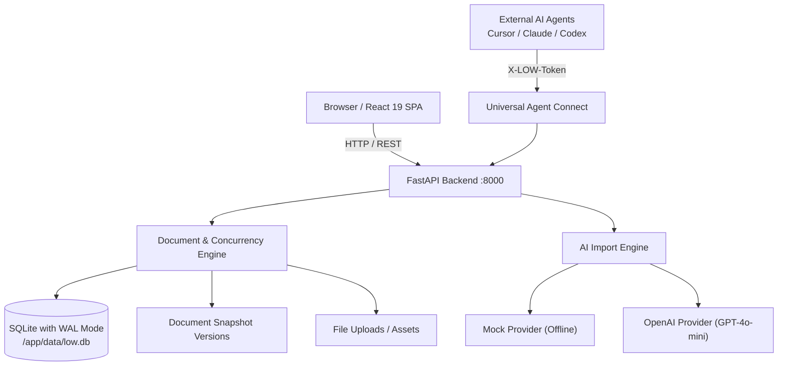
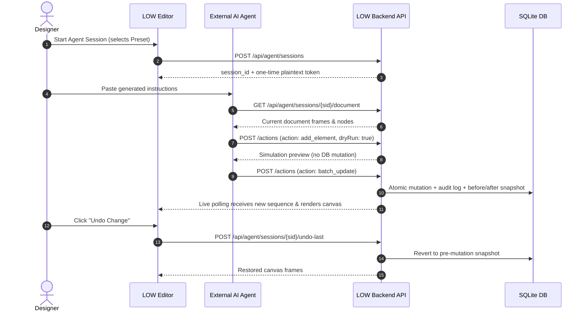

<div align="center">

# LOW (Lowcode Oriented Wireframe)

**Lightweight open-source UI/UX mobile design editor with AI Import and Universal Agent Connect.**

[](LICENSE)
[](.github/workflows/ci.yml)
[](https://fastapi.tiangolo.com)
[](https://react.dev)
[](https://sqlite.org)

*Self-hosted • Monochrome Minimalist • Open `.low.json` Format • Agent-Ready*

[English](#overview) | [Bahasa Indonesia](#ringkasan-bahasa-indonesia) | [Documentation](docs/) | [Release Checklist](RELEASE_CHECKLIST.md)

</div>

---

## Overview

**LOW** is a distraction-free, self-hosted mobile UI/UX design tool built with **FastAPI**, **SQLite**, and **React 19**. It emphasizes disciplined monochrome aesthetics (`#18181b`, `#f4f4f5`), transparent `.low.json` document storage, and an open protocol (**Universal Agent Connect**) that allows external AI agents (Claude, Cursor, Codex, Antigravity, Hermes) to inspect, design, and modify screens safely and atomically.

### Ringkasan (Bahasa Indonesia)
LOW adalah editor wireframe mobile open-source yang ringan dan dapat di-self-host. Berbeda dengan tools desain konvensional yang rumit dan tertutup, LOW fokus pada wireframing mobile dengan palet monokrom minimalis, format file terbuka `.low.json`, mesin **AI Import** untuk generate screen dari teks, dan protokol **Universal Agent Connect** yang memungkinkan agent AI eksternal mengontrol dan memanipulasi desain secara aman dengan token scoped, dry-run, dan fitur undo instan.

---

## Key Features

- **Monochrome Minimalist Canvas**: Mobile-first design environment focused on hierarchy, typography, and UX flow without visual noise.
- **Auto Layout & Responsive Containers**: Flexbox layout engine with direction (vertical/horizontal), gap, padding, alignment, justification, wrapping, and child sizing (`fill`, `hug`, `fixed`). Shortcut: `Shift + A`.
- **Responsive Constraints & Screen Presets**: Horizontal (`left`, `right`, `left-right`, `center`, `scale`) and vertical constraints that dynamically recalculate layout when switching screen presets (`iPhone 15`, `iPhone SE`, `Android Compact`, `Android Large`, `Custom Size`).
- **Safe Area Insets & Scroll Areas**: Visual safe area guidelines in canvas and interactive preview, plus scrollable viewport containers (`scrollArea`).
- **Typography & Reusable Component System**: Master component library with instance overrides (`detachInstance`), 11 design style presets, and design tokens (colors, radii, spacing).
- **Multi-Select, Marquee & Workflow**: Multi-element marquee/lasso selection, `Shift+Click` / `Cmd+Click`, group/ungroup (`Ctrl+G`), alignment tools, and distribute spacing.
- **Developer Inspect Mode & Handoff Panel**: Read-only canvas inspection (`Design | Prototype | Inspect`) with complete node metrics, box-model dimensions, auto layout properties, constraints, typography, and styling.
- **Instant Code & Token Generators**: 1-click CSS snippet generator, Tailwind utility classes, JSON schema copy, and CSS design token export.
- **Asset Export (SVG & PNG)**: Export screens or selected components to SVG and PNG directly in-browser with zero external bloat.
- **Offline Interactive Prototype Package**: Export full prototype zip with standalone zero-dependency HTML viewer (`index.html`) and `.low-prototype.json`.
- **Open `.low.json` Format**: Full document ownership. No proprietary formats, vendor lock-in, or hidden databases.
- **AI Import Engine**: Generate production-ready mobile screens, component sets, and interactive navigation flows from natural language prompts. Works offline with zero-cost mock mode or connects to OpenAI & OpenAI-compatible endpoints.
- **Universal Agent Connect (v2.4.0)**: Scoped HTTP API empowering external AI agents (Cursor, Claude, Codex, Antigravity) to read, modify, and export canvas documents in real-time, now with 33 atomic operations.
- **Dry-Run & Atomic Batch Updates**: Simulate agent actions without mutating documents, or apply up to 25 operations in a single atomic transaction.
- **Reversible Audit Trail**: Pre- and post-mutation snapshots on every agent event with instant 1-click undo.
- **Self-Hostable in Seconds**: Lightweight stack running on SQLite (`aiosqlite` with WAL mode) packaged via clean Docker Compose or 1-click Windows launcher (`run.bat`).


---

## Architecture Diagrams

### 1. High-Level Architecture



### 2. Universal Agent Connect Flow


---

## Quick Start

### 1-Click Launch on Windows
On Windows, you can simply double-click **`run.bat`** in the root directory (or run `run.bat` in terminal). It will automatically configure `.env`, seed the database, launch both backend and frontend, and open [http://localhost:3000](http://localhost:3000).

### With Docker Compose (Recommended for Production)
The fastest way to launch LOW on Linux, macOS, or a VPS:

```bash
# 1. Clone repository
git clone https://github.com/nuexn0x-9/low.git
cd low


# 2. Copy environment template
cp .env.example .env

# 3. Start containers
docker compose up -d --build
```

Access the application:
- **Frontend**: [http://localhost:3000](http://localhost:3000)
- **Backend API Docs**: [http://localhost:8000/docs](http://localhost:8000/docs)
- **Health Check**: [http://localhost:8000/api/health](http://localhost:8000/api/health)

To stop the containers:
```bash
docker compose down
```

---

## Manual Development Setup

If you wish to develop LOW locally without Docker:

### Prerequisites
- Python 3.10+
- Node.js 18+ & npm
- SQLite3

### Backend Setup
```bash
cd backend
python -m venv .venv

# Activate virtual environment
source .venv/bin/activate  # On Windows: .venv\Scripts\Activate.ps1

pip install -r requirements.txt
python scripts/seed.py
uvicorn app.main:app --reload --host 0.0.0.0 --port 8000
```

### Frontend Setup
```bash
cd frontend
npm install
npm start
```

---

## Default Development Account

When `ALLOW_DEV_LOCAL_USER=true` (default in `.env`), LOW automatically authenticates in local development mode with a pre-seeded account:
- **Email**: `local@low.design`
- **Name**: `Local Designer`

---

## Useful CLI Commands (Makefile)

LOW includes a root `Makefile` for streamlined development:

| Command | Description |
|---|---|
| `make dev` | Start backend and frontend concurrently |
| `make test` | Run both backend pytest and frontend jest suites |
| `make test-backend` | Run all 36 pytest backend test cases |
| `make test-frontend`| Run Jest unit and integration tests |
| `make build` | Compile optimized frontend production bundle |
| `make docker-up` | Build and start Docker Compose in background |
| `make docker-down` | Stop running Docker Compose containers |
| `make seed` | Seed default components and templates |
| `make backup` | Create a consistent SQLite snapshot in `backups/` |
| `make reset-dev` | Reset SQLite development database |

---

## Backup & Disaster Recovery

Taking a safe, consistent live snapshot of your design documents is simple:

```bash
# Using CLI script:
python backend/scripts/backup.py

# Inside Docker:
docker compose exec backend python scripts/backup.py
```
Snapshots are created using SQLite's native online backup API and stored in `backups/`. See [`docs/BACKUP_RESTORE.md`](docs/BACKUP_RESTORE.md) for full restoration procedures.

---

## Documentation Index

- [Installation Guide (`docs/INSTALLATION.md`)](docs/INSTALLATION.md)
- [User Manual (`docs/USAGE.md`)](docs/USAGE.md)
- [Self-Hosting & Nginx/Caddy Guide (`docs/SELF_HOSTING.md`)](docs/SELF_HOSTING.md)
- [Developer Guide (`docs/DEVELOPMENT.md`)](docs/DEVELOPMENT.md)
- [Backup & Restore Guide (`docs/BACKUP_RESTORE.md`)](docs/BACKUP_RESTORE.md)
- [AI Import Engine Guide (`docs/AI_IMPORT_ENGINE.md`)](docs/AI_IMPORT_ENGINE.md)
- [Universal Agent Protocol (`docs/AGENT_PROTOCOL.md`)](docs/AGENT_PROTOCOL.md)
- [Agent Action Catalog (`docs/AGENT_ACTIONS.md`)](docs/AGENT_ACTIONS.md)
- [The `.low.json` Format Spec (`docs/LOW_FORMAT.md`)](docs/LOW_FORMAT.md)
- [Model Context Protocol Bridge Notes (`docs/MCP_BRIDGE_NOTES.md`)](docs/MCP_BRIDGE_NOTES.md)
- [Product Roadmap (`docs/ROADMAP.md`)](docs/ROADMAP.md)
- [Frequently Asked Questions (`docs/FAQ.md`)](docs/FAQ.md)

---

## Contributing

We welcome contributions from developers, designers, and AI researchers! Please see [CONTRIBUTING.md](CONTRIBUTING.md) and our [Code of Conduct](CODE_OF_CONDUCT.md) before opening a pull request.

---

## Security

For vulnerability disclosures and security policies, please consult [SECURITY.md](SECURITY.md).

---

## License

LOW is free and open-source software licensed under the **GNU Affero General Public License v3.0 (AGPL-3.0)**. See the [LICENSE](LICENSE) file for full license text.
