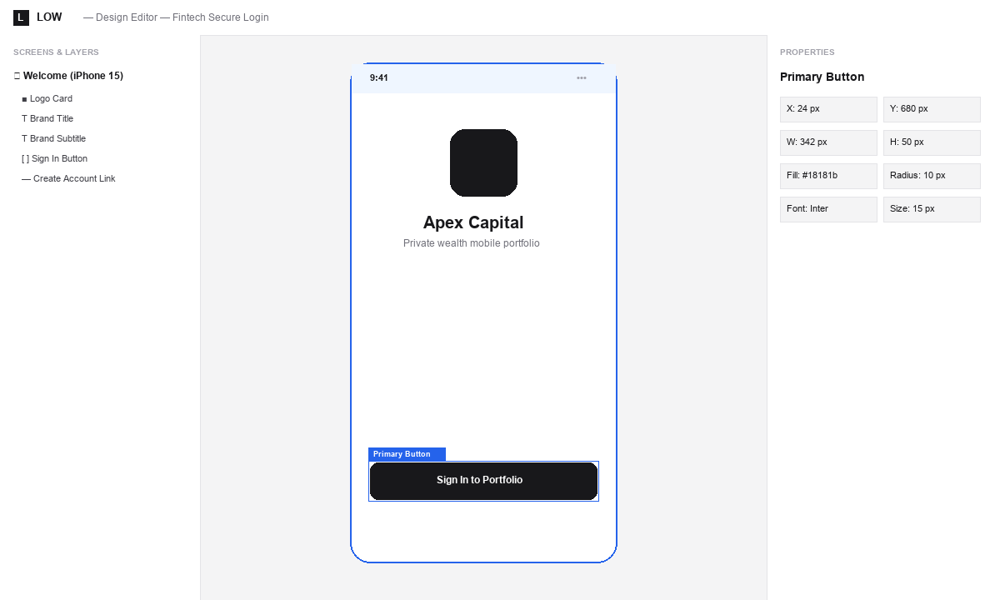
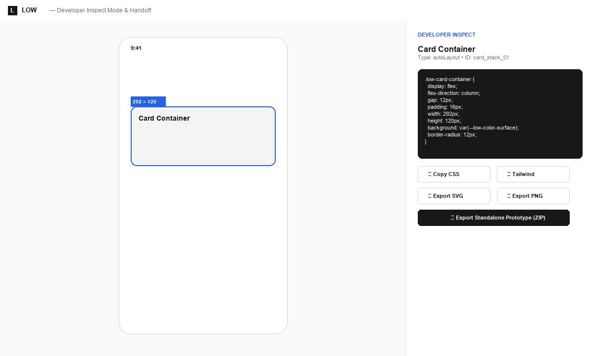
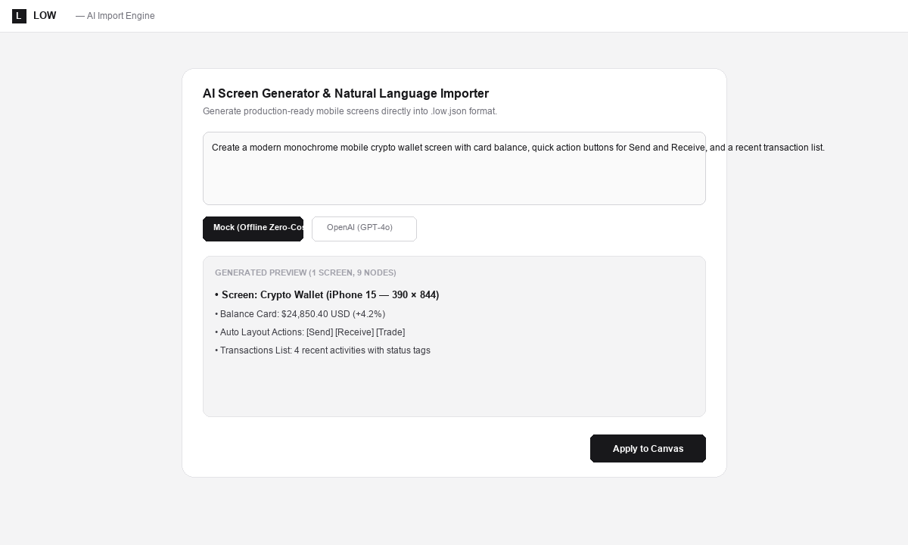
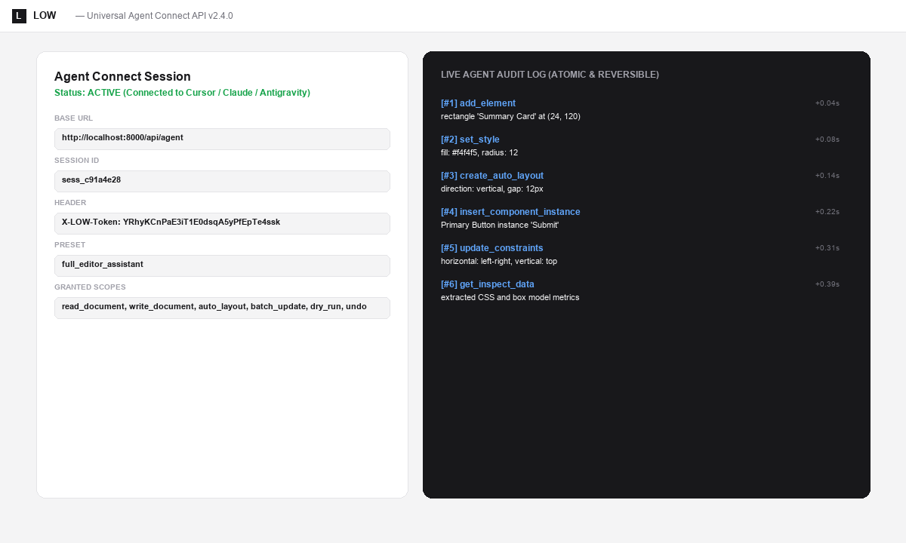
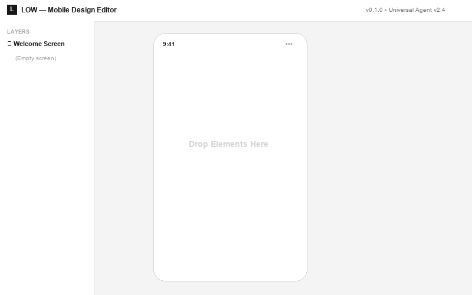
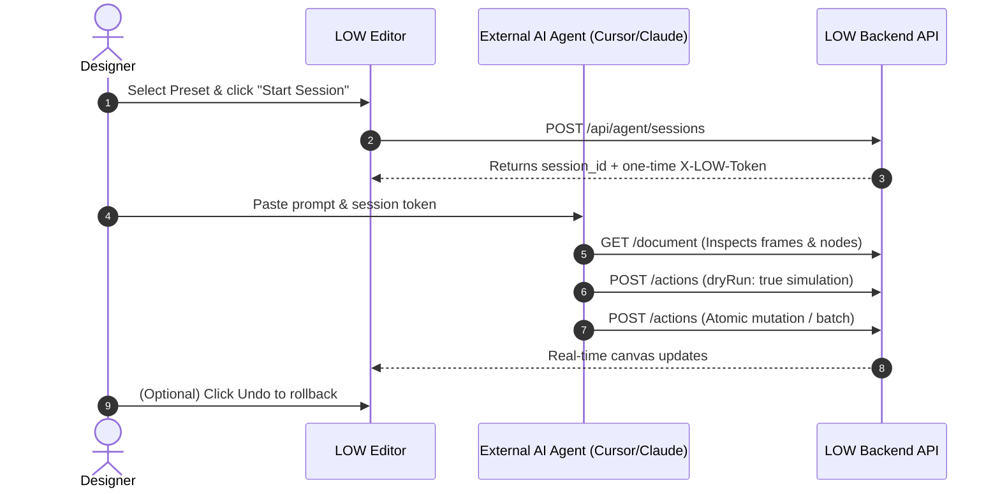
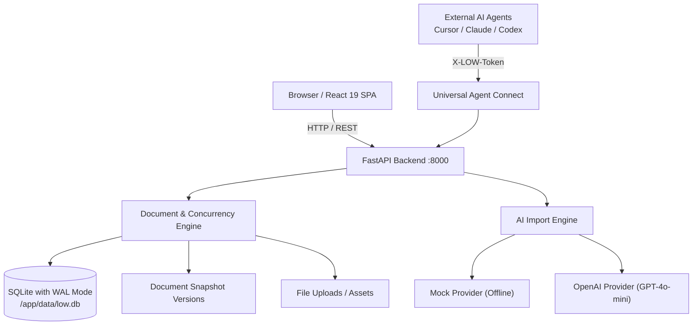
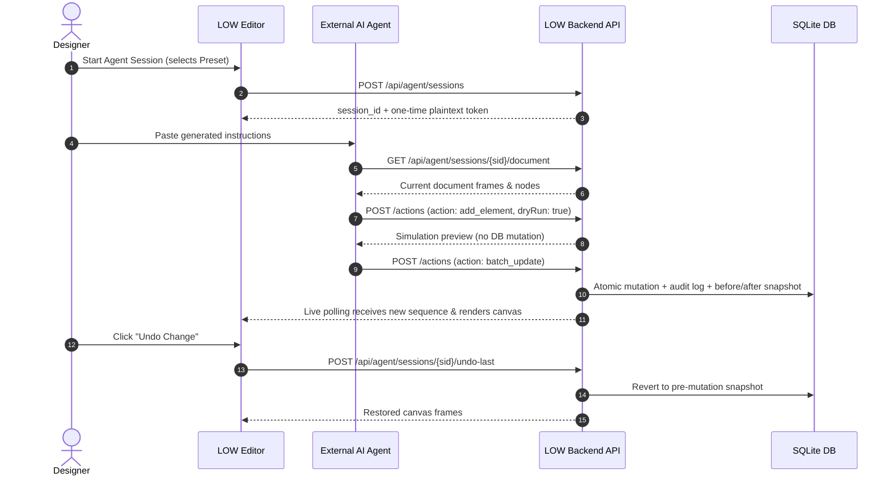

<div align="center">

# LOW (Lowcode Oriented Wireframe)

**Lightweight open-source UI/UX mobile design editor with AI Import and Universal Agent Connect.**

[](https://github.com/nuexn0x-9/low/releases)
[](LICENSE)
[](.github/workflows/ci.yml)
[](docker-compose.yml)
[](https://fastapi.tiangolo.com)
[](https://react.dev)
[](https://sqlite.org)
[](https://github.com/nuexn0x-9/low)

*Self-hosted • Monochrome Minimalist • Open `.low.json` Format • Agent-Ready*

[English](#overview) | [Bahasa Indonesia](#ringkasan-bahasa-indonesia) | [AI & Agent Tutorials](#tutorials-connecting-to-ai-import--agent-connect) | [Try with Docker (2 Mins)](#try-with-docker-compose-in-2-minutes) | [Documentation](docs/) | [Sample Projects](examples/)

<br />



</div>

---

## Overview

**LOW** is a distraction-free, self-hosted mobile UI/UX design tool built with **FastAPI**, **SQLite**, and **React 19**. It emphasizes disciplined monochrome aesthetics (`#18181b`, `#f4f4f5`), transparent `.low.json` document storage, and an open protocol (**Universal Agent Connect**) that allows external AI agents (Claude, Cursor, Codex, Antigravity, Hermes) to inspect, design, and modify screens safely and atomically.

### Ringkasan (Bahasa Indonesia)
LOW adalah editor wireframe mobile open-source yang ringan dan dapat di-self-host. Berbeda dengan tools desain konvensional yang rumit dan tertutup, LOW fokus pada wireframing mobile dengan palet monokrom minimalis, format file terbuka `.low.json`, mesin **AI Import** untuk generate screen dari teks, dan protokol **Universal Agent Connect** yang memungkinkan agent AI eksternal mengontrol dan memanipulasi desain secara aman dengan token scoped, dry-run, dan fitur undo instan.

---

## Why LOW?

Traditional cloud UI/UX design tools (Figma, Sketch, Adobe XD) have become heavy, proprietary walled gardens that lock user designs in opaque binary clouds and charge subscription fees for developer handoff.

| Feature | Conventional Design Tools | LOW (Lowcode Oriented Wireframe) |
|---|---|---|
| **Hosting & Data Privacy** | Proprietary SaaS Cloud (Vendor Lock-in) | **100% Self-Hosted** (Docker / SQLite WAL) |
| **File Format** | Binary / Closed Format | **Transparent `.low.json` Human-Readable Schema** |
| **AI Agent Integration** | Limited / Proprietary Chatbots | **Universal Agent Connect (v2.4.0)** with 33 atomic actions |
| **Handoff & Developer Mode**| Paid add-on / seat upsell | **Free Built-in CSS, Tailwind, & Token Generator** |
| **Offline Prototype Export**| Requires paid web viewer | **Zero-Dependency `prototype.zip` (Offline HTML)** |
| **Aesthetics** | Cluttered multi-color noise | **Disciplined Monochrome Minimalist Canvas** |

---

## Visual Showcase

| Design Editor | Developer Inspect Mode |
|---|---|
|  |  |

| AI Import Engine | Universal Agent Connect |
|---|---|
|  |  |

<div align="center">
  
</div>

---

## AI Agent Ready

LOW is engineered from the ground up for the agentic coding era. Through **Universal Agent Connect v2.4.0**, external AI agents (Cursor, Claude Desktop, Antigravity, Codex, Hermes) can connect over scoped HTTP tokens:
- **33 Atomic Operations**: Create screens, nest auto layout, bind component instances, edit typography, query box-model metrics, and export SVG.
- **Safety First**: Granular scopes (`read_document`, `write_document`, `auto_layout`, `export_assets`, etc.).
- **Simulation**: Support for `dryRun: true` allows agents to preview outcomes without committing mutations.
- **Atomic Batching**: Execute up to 25 operations in a single atomic transaction.
- **Instant Rollback**: 1-click audit trail snapshot undo in the web UI.

---

## Tutorials: Connecting to AI Import & Agent Connect

### 1. How to Connect & Use AI Import Engine

The **AI Import Engine** generates production-ready, editable mobile screens, components, and interactive prototype flows from natural language prompts directly into `.low.json`.

#### Option A: Zero-Configuration Offline Mock Mode (Default)
LOW includes an offline deterministic mock provider that requires **zero API keys** and zero cost. It is ideal for local testing, fintech flows, settings screens, and bottom navigation:
1. Open the LOW Editor in your browser ([http://localhost:3000](http://localhost:3000)).
2. In the left sidebar, click the **AI Import** tab (`Sparkles` icon).
3. Choose a prompt template or type your own (e.g. *"Fintech login screen with phone input and sign in button"*).
4. Select the **Output Type**: `Screen`, `Component`, `Template`, or `Prototype Flow`.
5. Click **Generate Draft** &rarr; review the generated layout preview &rarr; click **Apply to Canvas**.

#### Option B: Connecting OpenAI or Local LLMs (Ollama, vLLM, DeepSeek)

You can connect LOW to OpenAI (`gpt-4o-mini`, `gpt-4o`) or any OpenAI-compatible local/remote endpoint in two ways:

##### Method 1: In-App UI Configuration (Easiest)
1. In the LOW Editor, open the left sidebar and switch to the **AI Import** tab.
2. Click the **⚙️ (Gear Icon)** in the AI Import panel header to open **AI Import Settings**.
3. Select your provider:
   - **OpenAI**: Enter your `sk-...` API key. Default model: `gpt-4o-mini`.
   - **OpenAI Compatible**: Connect to **Ollama** (`http://localhost:11434/v1`), **vLLM** (`http://localhost:8000/v1`), **LocalAI**, or **DeepSeek**.
4. Set the **Model Name** (e.g. `gpt-4o-mini`, `llama3.2`, `deepseek-chat`).
5. Click **Test Connection** to verify endpoint reachability and latency.
6. Click **Save Settings**. Your API key is stored securely with masked credentials.

##### Method 2: Environment Variables (`.env`)
In your root `.env` file (or Docker environment):
```env
# Choose provider: 'mock' (default) or 'openai'
AI_PROVIDER=openai

# OpenAI API Key (or local LLM dummy key like 'ollama')
OPENAI_API_KEY=sk-your-openai-api-key

# Optional: Custom base URL for Ollama / vLLM / DeepSeek
OPENAI_BASE_URL=https://api.openai.com/v1
# For Ollama: OPENAI_BASE_URL=http://localhost:11434/v1

# Model selection
AI_MODEL=gpt-4o-mini
AI_TIMEOUT_SECONDS=30
```
Then restart your backend or Docker container:
```bash
docker compose restart backend
```

---

### 2. How to Connect External AI Agents via Universal Agent Connect

**Universal Agent Connect (v2.4.0)** enables autonomous coding assistants (**Cursor**, **Claude Desktop**, **Google Antigravity**, **OpenAI Codex**, **Hermes**) to inspect, edit, and export your canvas wireframes over a secure, scoped HTTP protocol.



#### Step 1: Start an Agent Session in the Web UI
1. Open the LOW Editor in your browser ([http://localhost:3000](http://localhost:3000)).
2. In the left sidebar, click the **Agent** tab (`Bot` icon).
3. Choose a **Permission Preset**:
   - `Full Editor Assistant` (Default: complete document read/write/export access)
   - `Design Assistant` (Layout, nodes, components, styling)
   - `Prototype Assistant` (Interactions, navigation, links)
   - `Read Only` (Document inspection without mutations)
4. (Optional) Toggle **Dry Run Mode** if you want the agent to simulate mutations without modifying your document.
5. Click **Start Session**.

#### Step 2: Copy Token & Instructions
- LOW generates a unique session ID and a one-time secret token:
  ```http
  X-LOW-Token: low_agent_...
  ```
- Click **Copy Instructions** to copy pre-formatted system prompts tailored for your agent.

#### Step 3: Connect Your AI Assistant (Cursor, Claude, Antigravity, etc.)
Paste the copied instructions into your AI agent's chat or prompt window:
```txt
You are connected to LOW Universal Agent Connect.
Base URL: http://localhost:8000
Session ID: <YOUR_SESSION_ID>
Header: X-LOW-Token: <YOUR_TOKEN>

Please inspect the current canvas document and add a "Sign Up" button below the login card.
```

#### Step 4: How the Agent Interacts with LOW (cURL Examples)

##### A. Read Current Canvas Document
```bash
curl -X GET http://localhost:8000/api/agent/sessions/<SESSION_ID>/document \
  -H "X-LOW-Token: <YOUR_TOKEN>"
```

##### B. Safe Simulation (Dry Run)
Test how a change looks without actually saving it to the database:
```bash
curl -X POST http://localhost:8000/api/agent/sessions/<SESSION_ID>/actions \
  -H "Content-Type: application/json" \
  -H "X-LOW-Token: <YOUR_TOKEN>" \
  -d '{
    "action": "add_element",
    "dryRun": true,
    "params": {
      "type": "button",
      "name": "Sign Up Button",
      "text": "Create Free Account",
      "x": 24,
      "y": 440,
      "width": 342,
      "height": 50,
      "style": { "fill": "#18181b", "color": "#ffffff", "radius": 10 }
    }
  }'
```

##### C. Apply an Atomic Mutation (Single Action)
```bash
curl -X POST http://localhost:8000/api/agent/sessions/<SESSION_ID>/actions \
  -H "Content-Type: application/json" \
  -H "X-LOW-Token: <YOUR_TOKEN>" \
  -d '{
    "action": "add_element",
    "params": {
      "type": "button",
      "name": "Sign Up Button",
      "text": "Create Free Account",
      "x": 24,
      "y": 440,
      "width": 342,
      "height": 50,
      "style": { "fill": "#18181b", "color": "#ffffff", "radius": 10 }
    }
  }'
```

##### D. Execute an Atomic Batch (Up to 25 operations in 1 transaction)
```bash
curl -X POST http://localhost:8000/api/agent/sessions/<SESSION_ID>/actions \
  -H "Content-Type: application/json" \
  -H "X-LOW-Token: <YOUR_TOKEN>" \
  -d '{
    "action": "batch_update",
    "params": {
      "operations": [
        {
          "action": "create_screen",
          "params": { "name": "Success Screen", "width": 390, "height": 844 }
        },
        {
          "action": "add_element",
          "params": {
            "type": "text",
            "name": "Success Title",
            "text": "Payment Successful!",
            "x": 24,
            "y": 100,
            "width": 342,
            "height": 40,
            "style": { "fontSize": 20, "fontWeight": 700, "align": "center" }
          }
        }
      ]
    }
  }'
```

##### E. Instant Undo / Rollback
If an agent makes a mistake, revert instantly either:
- **In the UI**: Click **Undo** next to any event in the live audit log inside the Agent tab.
- **Via API**:
  ```bash
  curl -X POST http://localhost:8000/api/agent/sessions/<SESSION_ID>/undo-last \
    -H "X-LOW-Token: <YOUR_TOKEN>"
  ```

---

## Sample Projects (`examples/`)

Pre-built, production-quality `.low.json` projects are included in [`examples/`](examples/) and can be imported directly into LOW:

1. **[Fintech Secure Login (`examples/fintech-login.low.json`)](examples/fintech-login.low.json)**:
   - 2-screen mobile flow with Splash, Phone authentication, design tokens, and prototype tap navigation.
2. **[3-Screen Onboarding Flow (`examples/onboarding-flow.low.json`)](examples/onboarding-flow.low.json)**:
   - Guided onboarding carousel with step indicator dots, skip links, and interactive slide transitions.
3. **[Marketplace Home (`examples/marketplace-home.low.json`)](examples/marketplace-home.low.json)**:
   - Product catalog with search bar, promo card, responsive product grid, and reusable bottom navigation.
4. **[Agent Generated Flow (`examples/agent-generated-flow.low.json`)](examples/agent-generated-flow.low.json)**:
   - Autonomous system overview screen with auto layout stacks, sizing constraints, and metric labels.

---

## Key Features

- **Monochrome Minimalist Canvas**: Mobile-first design environment focused on hierarchy, typography, and UX flow without visual noise.
- **Auto Layout & Responsive Containers**: Flexbox layout engine with direction (vertical/horizontal), gap, padding, alignment, justification, wrapping, and child sizing (`fill`, `hug`, `fixed`). Shortcut: `Shift + A`.
- **Responsive Constraints & Screen Presets**: Horizontal (`left`, `right`, `left-right`, `center`, `scale`) and vertical constraints that dynamically recalculate layout when switching screen presets (`iPhone 15`, `iPhone SE`, `Android Compact`, `Android Large`, `Custom Size`).
- **Safe Area Insets & Scroll Areas**: Visual safe area guidelines in canvas and interactive preview, plus scrollable viewport containers (`scrollArea`).
- **Typography & Reusable Component System**: Master component library with instance overrides (`detachInstance`), 11 design style presets, and design tokens (colors, radii, spacing).
- **Multi-Select, Marquee & Workflow**: Multi-element marquee/lasso selection, `Shift+Click` / `Cmd+Click`, group/ungroup (`Ctrl+G`), alignment tools, and distribute spacing.
- **Developer Inspect Mode & Handoff Panel**: Read-only canvas inspection (`Design | Prototype | Inspect`) with complete node metrics, box-model dimensions, auto layout properties, constraints, typography, and styling.
- **Instant Code & Token Generators**: 1-click CSS snippet generator, Tailwind utility classes, JSON schema copy, and CSS design token export.
- **Asset Export (SVG & PNG)**: Export screens or selected components to SVG and PNG directly in-browser with zero external bloat.
- **Offline Interactive Prototype Package**: Export full prototype zip with standalone zero-dependency HTML viewer (`index.html`) and `.low-prototype.json`.
- **Open `.low.json` Format**: Full document ownership. No proprietary formats, vendor lock-in, or hidden databases.
- **AI Import Engine**: Generate production-ready mobile screens, component sets, and interactive navigation flows from natural language prompts. Works offline with zero-cost mock mode or connects to OpenAI & OpenAI-compatible endpoints.
- **Universal Agent Connect (v2.4.0)**: Scoped HTTP API empowering external AI agents (Cursor, Claude, Codex, Antigravity) to read, modify, and export canvas documents in real-time, now with 33 atomic operations.
- **Dry-Run & Atomic Batch Updates**: Simulate agent actions without mutating documents, or apply up to 25 operations in a single atomic transaction.
- **Reversible Audit Trail**: Pre- and post-mutation snapshots on every agent event with instant 1-click undo.
- **Self-Hostable in Seconds**: Lightweight stack running on SQLite (`aiosqlite` with WAL mode) packaged via clean Docker Compose or 1-click Windows launcher (`run.bat`).


---

## Architecture Diagrams

### 1. High-Level Architecture



### 2. Universal Agent Connect Flow


---

## Try with Docker Compose in 2 Minutes

The fastest way to launch LOW on Linux, macOS, or Windows/VPS:

```bash
# 1. Clone repository
git clone https://github.com/nuexn0x-9/low.git
cd low


# 2. Copy environment template
cp .env.example .env

# 3. Start containers
docker compose up -d --build
```

Access the application:
- **Frontend**: [http://localhost:3000](http://localhost:3000)
- **Backend API Docs**: [http://localhost:8000/docs](http://localhost:8000/docs)
- **Health Check**: [http://localhost:8000/api/health](http://localhost:8000/api/health)

To stop the containers:
```bash
docker compose down
```

---

## Manual Development Setup

If you wish to develop LOW locally without Docker:

### Prerequisites
- Python 3.10+
- Node.js 18+ & npm
- SQLite3

### Backend Setup
```bash
cd backend
python -m venv .venv

# Activate virtual environment
source .venv/bin/activate  # On Windows: .venv\Scripts\Activate.ps1

pip install -r requirements.txt
python scripts/seed.py
uvicorn app.main:app --reload --host 0.0.0.0 --port 8000
```

### Frontend Setup
```bash
cd frontend
npm install
npm start
```

---

## Default Development Account

When `ALLOW_DEV_LOCAL_USER=true` (default in `.env`), LOW automatically authenticates in local development mode with a pre-seeded account:
- **Email**: `local@low.design`
- **Name**: `Local Designer`

---

## Useful CLI Commands (Makefile)

LOW includes a root `Makefile` for streamlined development:

| Command | Description |
|---|---|
| `make dev` | Start backend and frontend concurrently |
| `make test` | Run both backend pytest and frontend jest suites |
| `make test-backend` | Run all 36 pytest backend test cases |
| `make test-frontend`| Run Jest unit and integration tests |
| `make build` | Compile optimized frontend production bundle |
| `make docker-up` | Build and start Docker Compose in background |
| `make docker-down` | Stop running Docker Compose containers |
| `make seed` | Seed default components and templates |
| `make backup` | Create a consistent SQLite snapshot in `backups/` |
| `make reset-dev` | Reset SQLite development database |

---

## Backup & Disaster Recovery

Taking a safe, consistent live snapshot of your design documents is simple:

```bash
# Using CLI script:
python backend/scripts/backup.py

# Inside Docker:
docker compose exec backend python scripts/backup.py
```
Snapshots are created using SQLite's native online backup API and stored in `backups/`. See [`docs/BACKUP_RESTORE.md`](docs/BACKUP_RESTORE.md) for full restoration procedures.

---

## Documentation Index

- [Installation Guide (`docs/INSTALLATION.md`)](docs/INSTALLATION.md)
- [User Manual (`docs/USAGE.md`)](docs/USAGE.md)
- [Self-Hosting & Nginx/Caddy Guide (`docs/SELF_HOSTING.md`)](docs/SELF_HOSTING.md)
- [Developer Guide (`docs/DEVELOPMENT.md`)](docs/DEVELOPMENT.md)
- [Backup & Restore Guide (`docs/BACKUP_RESTORE.md`)](docs/BACKUP_RESTORE.md)
- [AI Import Engine Guide (`docs/AI_IMPORT_ENGINE.md`)](docs/AI_IMPORT_ENGINE.md)
- [Universal Agent Protocol (`docs/AGENT_PROTOCOL.md`)](docs/AGENT_PROTOCOL.md)
- [Agent Action Catalog (`docs/AGENT_ACTIONS.md`)](docs/AGENT_ACTIONS.md)
- [The `.low.json` Format Spec (`docs/LOW_FORMAT.md`)](docs/LOW_FORMAT.md)
- [Model Context Protocol Bridge Notes (`docs/MCP_BRIDGE_NOTES.md`)](docs/MCP_BRIDGE_NOTES.md)
- [Product Roadmap (`docs/ROADMAP.md`)](docs/ROADMAP.md)
- [Frequently Asked Questions (`docs/FAQ.md`)](docs/FAQ.md)

---

## Contributing

We welcome contributions from developers, designers, and AI researchers! Please see [CONTRIBUTING.md](CONTRIBUTING.md) and our [Code of Conduct](CODE_OF_CONDUCT.md) before opening a pull request.

---

## Security

For vulnerability disclosures and security policies, please consult [SECURITY.md](SECURITY.md).

---

## License

LOW is free and open-source software licensed under the **GNU Affero General Public License v3.0 (AGPL-3.0)**. See the [LICENSE](LICENSE) file for full license text.
